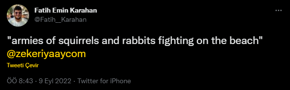
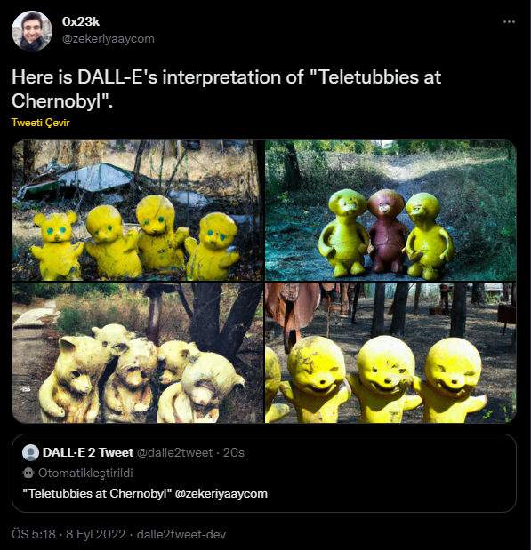

# DALL·E 2 & Twitter Bot

Generate image from tweets with DALL·E 2

## 🐦 Tweet Bot Usage

1. Write your prompt between quotes. Mention the Twitter Bot ([@zekeriyaaycom](https://twitter.com/zekeriyaaycom)).\
    Example: [](https://twitter.com/Fatih__Karahan/status/1568112910244757504)
1. Send tweet.
1. Wait for DALL-E's interpretation.\
    Example: [](https://twitter.com/zekeriyaaycom/status/1567879936320454659)

<br>

---

<br>

## 🚀 Make Own Tweet Bot

1. Pull [dalle2tweet Docker Package](https://github.com/ZekeriyaAY/DALLE2Tweet/pkgs/container/dalle2tweet).
    ```sh
    $ docker pull ghcr.io/zekeriyaay/dalle2tweet:latest
    ```
1. Run Docker image with your own Twitter API & DALL·E 2 API credentials.
    ```sh
    $ docker run -it -e TWITTER_CONSUMER_KEY="*****" \
        -e TWITTER_CONSUMER_SECRET="*****" \
        -e TWITTER_ACCESS_TOKEN="****-********" \
        -e TWITTER_ACCESS_TOKEN_SECRET="*****" \
        -e DALLE_API_KEY="sess-*****" \
        ghcr.io/zekeriyaay/dalle2tweet    
    ```
1. They(your bot users) should tweet mentioning your own Twitter user(API Account) while using your bot.
